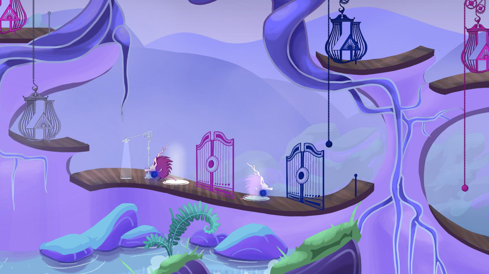
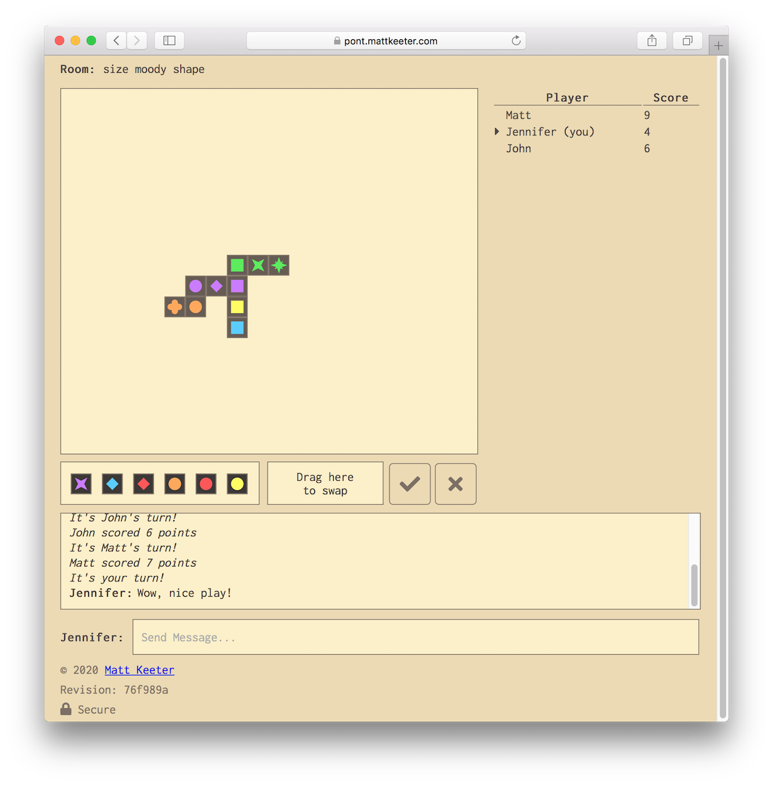
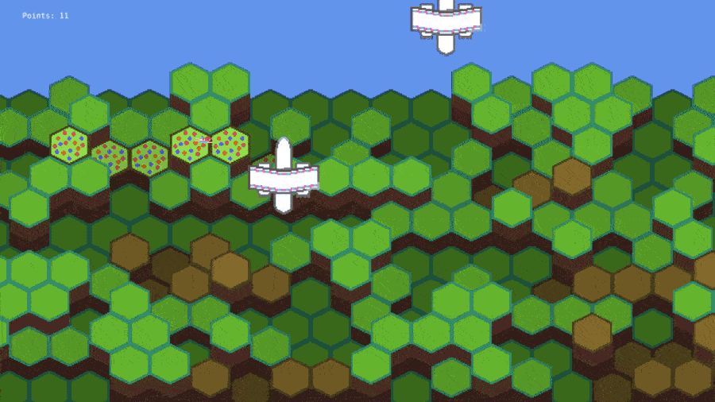
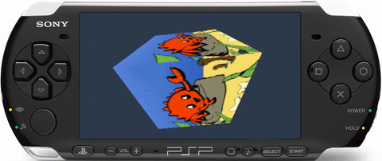
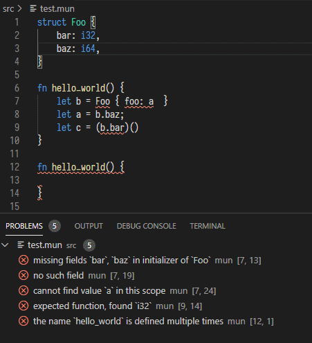

+++
title = "This Month in Rust GameDev #11 - June 2020"
date = 2020-07-01
transparent = true
draft = true
+++

Welcome to the eleventh issue of the Rust GameDev Workgroup’s
monthly newsletter.
[Rust] is a systems language pursuing the trifecta:
safety, concurrency, and speed.
These goals are well-aligned with game development.
We hope to build an inviting ecosystem for anyone wishing
to use Rust in their development process!
Want to get involved? [Join the Rust GameDev working group!][join]

You can follow the newsletter creation process
by watching [the coordination issues][coordination].
Want something mentioned in the next newsletter?
[Send us a pull request][pr].
Feel free to send PRs about your own projects!

[Rust]: https://rust-lang.org
[join]: https://github.com/rust-gamedev/wg#join-the-fun
[pr]: https://github.com/rust-gamedev/rust-gamedev.github.io
[coordination]: https://github.com/rust-gamedev/rust-gamedev.github.io/issues?q=label%3Acoordination

Table of contents:

- [Game Updates](#game-updates)
- [Learning Material Updates](#learning-material-updates)
- [Library & Tooling Updates](#library-tooling-updates)
- [Popular Workgroup Issues in Github](#popular-workgroup-issues-in-github)
- [Meeting Minutes](#meeting-minutes)
- [Requests for Contribution](#requests-for-contribution)
- [Jobs](#jobs)
- [Bonus](#bonus)

<!--
Ideal section structure is:

```
### [Title]


A paragraph or two with a summary and [useful links].

_Discussions:
[/r/rust](https://reddit.com/r/rust/todo),
[twitter](https://twitter.com/todo/status/123456)_

[Title]: https://first.link
[useful links]: https://other.link
```

Discussion links are added only if they contain
some actual interesting discussions.

If needed, a section can be split into subsections with a "------" delimiter.
-->

## Game Updates

### [Way of Rhea][rhea-site]

[][rhea-trailer]

^ _Click to see the latest version of the game's trailer_

[Way of Rhea][rhea-site] ([steam][rhea-steam])
is an upcoming puzzle platformer that takes place in a world
where you can only interact with objects that match your current color.
It's being build in a custom engine, and custom scripting language both written
in Rust by [Mason Remaley][@masonremaley]. This month's updates:

- A demo was released as part of the
  [Steam Game Festival](https://store.steampowered.com/sale/gamefestival)!
  The festival has since ended, so the demo is no longer available.
- [@masonremaley] ran An AMA [at /r/rust_gamedev][rhea-ama-1]
  and [/r/IndieDev][rhea-ama-2] about the development of the game.
- The studio hosted a [speedrun competition][rhea-speedrun] as part
  of the Steam festival, [here's the winning run](https://youtu.be/AmYU0TXc4Ls).
- A colorblind friendly mode was added to the game,
  and [a couple other changes][rhea-fest-update] were made in response
  to feedback from the festival.

Follow development updates on [the game's Twitter][rhea-twitter]
or [subscribe to its newsletter][rhea-newsletter].

[rhea-site]: https://www.anthropicstudios.com/way-of-rhea
[rhea-steam]: https://store.steampowered.com/app/1110620/Way_of_Rhea
[rhea-twitter]: https://twitter.com/anthropicst
[rhea-trailer]: https://youtube.com/watch?v=eVrbZss_B3g
[rhea-speedrun]: https://steamcommunity.com/app/1110620/discussions/0/2569815696856844856
[rhea-fest-update]: https://store.steampowered.com/newshub/app/1110620/view/2445966074565244552
[@masonremaley]: https://twitter.com/masonremaley
[rhea-ama-1]: https://reddit.com/r/rust_gamedev/comments/hc7vex/i_just_released_a_demo
[rhea-ama-2]: https://reddit.com/r/IndieDev/comments/hc7mf2/i_just_released_a_demo
[rhea-newsletter]: https://www.anthropicstudios.com/newsletter/signup/tech

### [A/B Street][abstreet] - Adjust Traffic Patterns in Real Cities


^ _Measuring the effects of some changes_

[A/B Street][abstreet] is a traffic simulation game exploring how
small changes to roads affect cyclists, transit users, pedestrians, and drivers.

June highlights:

- Alpha release with a [trailer][abstreet-trailer], an excited reaction from
  [r/seattle][abstreet-reddit], and some
  [local press coverage][abstreet-stranger]
- Support for parking lots, automatically inferring the number and position of
  individual slots from OpenStreetMap geometry
- Names of roads shown in-game, in a way that doesn't cause clutter with agents
  moving nearby
- Work starting on light rail and restricting through-traffic to zones

A/B Street uses a [custom GUI library][ezgui], leveraging `glium`, `usvg`, and
`lyon`. Help with Rust and visual/game design is always welcome! Check out the
[roadmap][abstreet-roadmap] and [good first issues][abstreet-issues].

[abstreet]: https://abstreet.org
[ezgui]: https://github.com/dabreegster/abstreet/tree/master/ezgui/
[abstreet-roadmap]: https://github.com/dabreegster/abstreet/blob/master/docs/roadmap.md
[abstreet-issues]: https://github.com/dabreegster/abstreet/issues?q=is%3Aopen+is%3Aissue+label%3A%22good+first+issue%22
[abstreet-trailer]: https://www.youtube.com/watch?v=LxPD4n_1-LU
[abstreet-reddit]: https://old.reddit.com/r/Seattle/comments/hdtucd/ab_street_think_you_can_fix_seattles_traffic/
[abstreet-stranger]: https://www.thestranger.com/slog/2020/06/29/43999454/ab-streets-game-lets-you-create-the-seattle-street-grid-of-your-dreams

### [Pont][pont-online]



Pont is a multiplayer online board game based on
[Qwirkle][qwirkle], implemented by [Matt Keeter][matt-keeter].
Both the client and server are written in Rust,
using WebAssembly to run the client in the browser
without any Javascript (besides a small shim).

It can be played online [here][pont-online]!

The system architecture is described in a [blog post][pont-blog]
and the source is available [on Github][pont-source]

_Discussions:
[/r/rust](https://www.reddit.com/r/rust/comments/gu1bq5/pont_a_board_game_in_rust_webassembly/),
[Hacker News](https://news.ycombinator.com/item?id=23649369)_

[matt-keeter]: https://twitter.com/impraxical
[pont-online]: https://pont.mattkeeter.com
[pont-blog]: https://mattkeeter.com/projects/pont
[pont-source]: https://github.com/mkeeter/pont
[qwirkle]: https://en.wikipedia.org/wiki/Qwirkle

### [runner]

[](https://vimeo.com/428851779)

[runner] is a simple side-scrolling endless runner game that takes place in
a bright world that only has our fearless adventurer & a few pesky beings
that are bent on keeping her from running! It uses [specs] for [ECS]
and has multiple frontends: [sdl2] & [quicksilver].
Between the two frontends it can target the majority of the platforms:
Web, Mac, Linux, Windows (untested) & possible even iOS & Android.

[runner]: https://github.com/jayrave/runner
[specs]: https://github.com/amethyst/specs
[ECS]: https://en.wikipedia.org/wiki/Entity_component_system
[sdl2]: https://github.com/Rust-SDL2/rust-sdl2
[quicksilver]: https://github.com/ryanisaacg/quicksilver

### [Animal Chess][AnimalChess]


^ _Part of the game map_

[Animal Fight Chess][AnimalChess] (斗兽棋, "Doe Show Chee") by [@netcan]
is a Rust implementation of a popular Chinese game.

To win the game, one player must successfully move any animal into
the Den(兽穴) of the opponent or eat all animals of the opponent.
The basic move is just one space either forward, backward, left, or right.
The pieces never move diagonally.
Each player has eight pieces,
[different animals with different degrees of power][animal-chess-pieces],
a larger power piece can eat a little power piece, but rat can eat elephant.
Here's a picture of the pieces, their English names,
and relative powers indicated by a number.
See full rules at [ancientchess.com][animal-chess-rules]
or [Wikipedia][animal-chess-wiki].

The project uses alpha beta pruning algorithm for AI and provides
a python module to use AlphaZero algorithm for training.

[AnimalChess]: https://github.com/netcan/AnimalChess
[@netcan]: https://github.com/netcan
[animal-chess-rules]: http://ancientchess.com/page/play-doushouqi.htm
[animal-chess-wiki]: https://en.wikipedia.org/wiki/Jungle_(board_game)
[animal-chess-pieces]: http://ancientchess.com/graphics-rules/dou_shou_qi_jungle_game-pieces-values.jpg

### [Guacamole Runner][guacamole]



[Guacamole Runner][guacamole] is a small game made with
[Tetra][tetra] and [Shipyard][shipyard] in approximately 2 days
by [@EllenNyan][ellen_twitter].
The game's concept is that the player is constantly falling
and must jump off planes to stay in the air.
When they go over the top of the dirt tiles
they plant flowers which gives them points.

[guacamole]: https://github.com/EllenNyan/guacamole-runner
[ellen_twitter]: https://twitter.com/EllenNyan0214
[tetra]: https://github.com/17cupsofcoffee/Tetra
[shipyard]: https://github.com/leudz/shipyard

## Learning Material Updates

## Library & Tooling Updates

### [rust-psp]



Just what everyone's always wanted, [Rust on the Sony PSP][rust-psp]! 😆

This project is a port and improvement of the unofficial C/C++ PSPSDK from
2005 It does not require a custom GCC toolchain to be installed. Only Rust
nightly and a cargo subcommand.

The psp crate provides a `psp::sys` submodule that houses the entire Sony PSP
API. We are working to have theseinterfaces merged into the libc crate.
The PSP unfortunately uses non-standard dynamic linking,
(and some libraries are statically linked!), so function definitions
marked extern are not enough. Eventually we will wrap this sys lib with a more
rust-friendly library.

Rather than patching LLVM or rustc, the rust-psp team has also merged a
`mipsel-sony-psp` target upstream, and published cargo-psp. This is a subcommand
that works exactly like cargo build, except it also builds the crate into a
PSP-specific executable format called `PRX` and packages that into an
`EBOOT.PBP`, the standard format for a PSP Homebrew.

The crate has reached full user-mode parity with the unofficial C/C++ SDK.
Kernel-mode support still needs to be worked on. Aside from library
imports, there is also support for PSP-specific custom assembly instructions
via the `vfpu_asm!` macro, with no need for a custom compiler toolchain.
There is also optional `embedded-graphics` support and a function to benchmark
or time your code.

The next major milestone for rust-psp is std support.
If you are interested in helping out, please feel free to join the rust-psp
channel in the [PSP Homebrew discord server](https://discord.gg/WY8XhDG).

[rust-psp]: https://github.com/overdrivenpotato/rust-psp

### [This Month in Mun][mun-june]



^ _Mun language server diagnostics in action_

[Mun] is a scripting language for gamedev focused on quick iteration times
that is written in Rust.

After the dust of the [Mun v0.2 release][mun-release] settled, this month focus
has been on fixing several issues found by community members, improving the
overall quality of the code base and working towards the next release: Mun v0.3.

Their [June updates][mun-june] include:

- [*Make It or Break It* contest](https://github.com/mun-lang/mun/issues/220);
- several fixes for issues that arose thanks to the contest;
- the foundation for Mun projects;
- an initial language server setup;

[Mun]: https://mun-lang.org
[mun-release]: https://mun-lang.org/blog/2020/05/16/release-mun-v0-2-0
[mun-june]: https://mun-lang.org/blog/2020/06/30/this-month-june

### [yaks]

[yaks] is a minimalistic framework for automatic multithreading
of [`hecs`] ECS library using [Rayon] data-parallelism library.

While the project itself started earlier this year, with this month's release
`yaks` gained an overhauled API, further leaning into the promise of
simplicity:

- systems are any functions or closures of a specific signature,
- `Executor` is a container for one or more systems,
- system execution order can be defined when building an `Executor`
  to create concurrent chains of systems,
- resources used by systems (any data that is not associated with an entity)
  are now borrowed for the duration of execution, instead of being owned
  by the framework.

All items in the library are exhaustively documented, and the repository
contains a fully annotated example.

Enabled-by-default `parallel` cargo feature can be disabled to force
everything in `yaks` to become single-threaded, which allows using code
written with the framework on platforms without threading - notably, web.

[yaks]: https://crates.io/crates/yaks
[`hecs`]: https://crates.io/crates/hecs
[Rayon]: https://crates.io/crates/rayon

### [Tetra 0.4][tetra-040]

[Tetra] is a simple 2D game framework, inspired by XNA and Raylib. This month,
[version 0.4][tetra-040] was released, featuring:

- A rework of the text rendering API, which improves performance and fixes a
  number of long-standing bugs
- Functions for capturing the player's mouse
- Various tweaks and bug fixes under the hood

Also, [a new guide has been added to Tetra's website][tetra-dist], listing some
things to consider when distributing your game to the public. This guide is
still a work in progress, so contributions are welcomed!

[tetra]: https://github.com/17cupsofcoffee/tetra
[tetra-040]: https://twitter.com/17cupsofcoffee/status/1275778769077317637
[tetra-dist]: https://tetra.seventeencups.net/distributing/

### [Arsenal Game Engine][arsenal]

[Arsenal] is the concept for a 2D and 3D game engine that is fully integrated
with [Blender] and built on a Rust core. The engine will be built around an
entity component system ( probably [Shipyard] ) for its performance and game
design advantages. The vision of Arsenal is to build an Open Source game engine
that is suitable for games of any scale and that is easily approachable by a
wide audience of both complete beginners and seasoned experts.

Arsenal currently has a [POC][ars_poc] working, but there is no support for
adding custom game logic. The next major step for Arsenal is to get initial
[scripting support][ship_script_support] in Shipyard. The scripting plan for
Arsenal borrows heavily from the [Amethyst scripting RFC][amethyst_scrpt_rfc]
with the first target scripting language being Python. Other languages that are
candidates for being added later are be [Mun], Lua, and maybe other languages
written in Rust such as [Gluon].

More information on the Arsenal development direction can be found in the latest
Arsenal development [blog post][arsenal_update].

[Katharos Technology][ktech] has gone live on [GitHub Sponsors][ghs_ktech] as a
means to fund development of the development of the [Arsenal] game engine and
supporting Rust gamedev libraries and tools such as [GFX], and [WGPU].

[ktech]: https://katharostech.com
[ghs_ktech]: https://github.com/sponsors/katharostech/
[arsenal]: https://github.com/katharostech/arsenal
[gfx]: https://github.com/gfx-rs/gfx
[wgpu]: https://github.com/gfx-rs/wgpu
[arsenal_update]: https://katharostech.com/post/arsenal-development-now-on-github-sponsors
[blender]: https://blender.org
[shipyard]: https://github.com/leudz/shipyard
[ship_script_support]: https://github.com/leudz/shipyard/issues/96
[amethyst_scrpt_rfc]: https://github.com/amethyst/rfcs/blob/master/0001-scripting.md
[mun]: https://mun-lang.org/
[gluon]: https://github.com/gluon-lang/gluon
[ars_poc]: https://github.com/katharostech/arsenal/releases/tag/v0.1.0

## Popular Workgroup Issues in Github

<!-- Up to 10 links to interesting issues -->

## Meeting Minutes

<!-- Up to 10 most important notes + a link to the full details -->

[See all meeting issues][label-meeting] including full text notes
or [join the next meeting][join].

[label-meeting]: https://github.com/rust-gamedev/wg/issues?q=label%3Ameeting

## Requests for Contribution

<!-- Links to "good first issue"-labels or direct links to specific tasks -->

- [Embark's open issues][embark-open-issues] ([embark.rs]);
- [winit's "Good first issue" and “help wanted” issues][winit-issues];
- [gfx-rs's "contributor-friendly" issues][gfx-issues];
- [wgpu's "help wanted" issues][wgpu-help-wanted];
- [luminance's "low hanging fruit" issues][luminance-fruits];
- [ggez's "good first issue" issues][ggez-issues];
- [Veloren's "beginner" issues][veloren-beginner];
- [Amethyst's "good first issue" issues][amethyst-issues];
- [A/B Street's "good first issue" issues][abstreet-issues];
- [Mun's "good first issue" issues][mun-issues];

[embark.rs]: https://embark.rs
[embark-open-issues]: https://github.com/search?q=user:EmbarkStudios+state:open
[winit-issues]: https://github.com/rust-windowing/winit/issues?utf8=✓&q=is%3Aissue+is%3Aopen+label%3A%22status%3A+help+wanted%22+label%3A%22Good+first+issue%22
[gfx-issues]: https://github.com/gfx-rs/gfx/issues?q=is%3Aissue+is%3Aopen+label%3Acontributor-friendly
[wgpu-help-wanted]: https://github.com/gfx-rs/wgpu-rs/issues?q=is%3Aissue+is%3Aopen+label%3A%22help+wanted%22
[luminance-fruits]: https://github.com/phaazon/luminance-rs/issues?q=is%3Aissue+is%3Aopen+label%3A%22low+hanging+fruit%22
[ggez-issues]: https://github.com/ggez/ggez/labels/%2AGOOD%20FIRST%20ISSUE%2A
[veloren-beginner]: https://gitlab.com/veloren/veloren/issues?label_name=beginner
[amethyst-issues]: https://github.com/amethyst/amethyst/issues?q=is%3Aissue+is%3Aopen+label%3A%22good+first+issue%22
[abstreet-issues]: https://github.com/dabreegster/abstreet/issues?q=is%3Aissue+is%3Aopen+label%3A%22good+first+issue%22
[mun-issues]: https://github.com/mun-lang/mun/labels/good%20first%20issue

## Jobs

<!-- An optional section for new jobs related to Rust gamedev -->

## Bonus

<!-- Bonus section to make the newsletter more interesting
and highlight events from the past. -->

Just an interesting Rust gamedev link from the past. :)

------

That's all news for today, thanks for reading!

Subscribe to [@rust_gamedev on Twitter][@rust_gamedev]
or [/r/rust_gamedev subreddit][/r/rust_gamedev] if you want to receive fresh news!

<!--
TODO: Add real links and un-comment once this post is published
**Discussions of this post**:
[/r/rust](TODO),
[twitter](TODO).
-->

[/r/rust_gamedev]: https://reddit.com/r/rust_gamedev
[@rust_gamedev]: https://twitter.com/rust_gamedev
